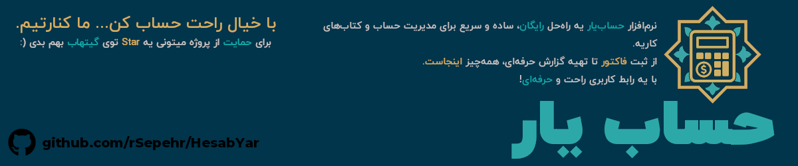

<p align="center">
  
</p>

<div dir="rtl">

<h1 align="center">نرم‌افزار حسابداری حساب‌یار (HesabYar)</h1>

<p align="center">
  <strong>یک نرم‌افزار حسابداری رایگان، متن‌باز و قدرتمند برای کسب‌وکارهای کوچک و متوسط ایرانی.</strong>
</p>

<p align="center">
  <a href="[!]#license">
    
  </a>
  <a href="#">
    
  </a>
  <a href="#">
    
  </a>
  <a href="https://github.com/rSepehr/HesabYar/issues">
    
  </a>
  <a href="https://github.com/rSepehr/HesabYar/stargazers">
    
  </a>
</p>

<br>

**حساب‌یار** یک نرم‌افزار دسکتاپ (Desktop) است که برای **ویندوز ۱۰ و ویندوز ۱۱** طراحی شده و هدف آن ساده‌سازی مدیریت مالی برای فروشگاه‌ها، فریلنسرها و کسب‌وکارهای کوچک است. از مدیریت فاکتورها و انبارداری گرفته تا گزارش‌های تحلیلی سود و زیان، حساب‌یار تمام ابزارهای لازم را به صورت **کاملاً رایگان** در اختیار شما قرار می‌دهد.

<br>

<p align="center">
  
</p>

---

## 🎯 چرا حساب‌یار؟

مدیریت مالی با استفاده از دفترچه‌های کاغذی یا فایل‌های اکسل پیچیده، مستعد خطا و وقت‌گیر است. حساب‌یار این فرآیندها را مکانیزه و ساده می‌کند تا شما بتوانید با خیال راحت روی رشد کسب‌وکار خود تمرکز کنید.

-   **سادگی در استفاده:** رابط کاربری ساده و کاملاً فارسی، بدون نیاز به دانش تخصصی حسابداری.
-   **مالکیت داده‌ها:** تمام اطلاعات شما روی کامپیوتر خودتان ذخیره می‌شود و هیچ داده‌ای به اینترنت ارسال نمی‌گردد.
-   **کاملاً رایگان و متن‌باز:** بدون هیچ هزینه اولیه یا اشتراک ماهانه. برای همیشه رایگان!
-   **ساخته شده برای ایران:** پشتیبانی کامل از تاریخ شمسی و واحد پولی ریال.

---

## ✨ ویژگی‌های کلیدی

حساب‌یار یک مجموعه کامل از ابزارهای مالی را ارائه می‌دهد:

-   **👨‍💼 مدیریت مشتریان و تامین‌کنندگان:** ثبت و دسته‌بندی اطلاعات تماس.
-   **📄 فاکتورهای فروش و خرید:**
    -   صدور فاکتورهای حرفه‌ای با قابلیت چاپ و خروجی PDF.
    -   محاسبه خودکار تخفیف، مالیات بر ارزش افزوده و هزینه‌های جانبی.
    -   پشتیبانی از پرداخت نقدی و چکی.
-   **📦 انبارداری هوشمند:**
    -   افزایش و کاهش خودکار موجودی کالا پس از ثبت فاکتور خرید یا فروش.
    -   محاسبه خودکار "بهای تمام شده کالا (COGS)" برای گزارش دقیق سود.
    -   هشدار برای کالاهای رو به اتمام.
-   **💸 مدیریت هزینه‌ها:** ثبت و دسته‌بندی هزینه‌های جاری (مثل اجاره، حقوق و...).
-   **💳 مدیریت چک‌ها:** ثبت چک‌های دریافتی، پیگیری وضعیت (پاس شده، برگشتی) و یادآوری تاریخ سررسید.
-   **📊 گزارش‌های جامع:**
    -   گزارش **سود و زیان** تحلیلی در بازه‌های زمانی دلخواه.
    -   دفتر روزنامه برای مرور تمام تراکنش‌های مالی.
    -   خروجی CSV از تمام داده‌ها برای تحلیل در اکسل.
-   **⚙️ تنظیمات پیشرفته:**
    -   پشتیبان‌گیری و بازیابی کامل دیتابیس با یک کلیک.
    -   شخصی‌سازی ظاهر برنامه با تم روشن/تاریک و رنگ‌های مختلف.
    -   تعریف سرفصل‌های حسابداری (درآمد و هزینه) به صورت دلخواه.
    -   ثبت اطلاعات و لوگوی شرکت برای نمایش در فاکتورها.

---

## 🚀 نصب و راه‌اندازی (مخصوص کاربران عادی)

استفاده از حساب‌یار بسیار ساده است. **نیازی به نصب پایتون یا دانش فنی ندارید.**

**سیستم مورد نیاز:**
-   **سیستم‌عامل:** ویندوز ۱۰ یا ویندوز ۱۱ (نسخه‌های 64 بیتی)

**مراحل نصب:**
1.  **دانلود برنامه:**
    به [**آخرین نسخه منتشر شده در صفحه دانلود (Releases)**](https://github.com/rSepehr/HesabYar/releases/latest) بروید.

2.  **خارج کردن از حالت فشرده:**
    فایل `HesabYar-vX.X.X.zip` را دانلود کرده و در هر جایی از کامپیوتر خود که دوست دارید، آن را از حالت فشرده خارج کنید (روی آن راست کلیک کرده و گزینه Extract All را بزنید).

3.  **اجرای برنامه:**
    وارد پوشه‌ای که از حالت فشرده خارج شده شوید و روی فایل **`main.exe`** دو بار کلیک کنید. برنامه اجرا خواهد شد!

---

## 👨‍💻 برای توسعه‌دهندگان (For Developers)

اگر علاقمند به مشارکت در توسعه حساب‌یار هستید، از مشارکت شما استقبال می‌کنیم!

**پیش‌نیازها:**
-   Python 3.9+
-   Git

**راه‌اندازی محیط توسعه:**

```bash
# 1. پروژه را کلون کنید
git clone [https://github.com/rSepehr/HesabYar.git](https://github.com/rSepehr/HesabYar.git)

# 2. وارد پوشه پروژه شوید
cd HesabYar

# 3. (اختیاری ولی پیشنهادی) یک محیط مجازی بسازید
python -m venv venv
source venv/bin/activate  # در لینوکس/مک
# venv\Scripts\activate    # در ویندوز

# 4. پیش‌نیازها را نصب کنید
pip install -r requirements.txt

# 5. برنامه را اجرا کنید
python main.py
```

### 🛠️ تکنولوژی‌های استفاده شده

-   **زبان برنامه‌نویسی:** Python 3
-   **رابط کاربری گرافیکی:** PySide6 (Qt 6)
-   **پایگاه داده:** SQLite 3
-   **تولید PDF:** ReportLab
-   **پشتیبانی از تاریخ شمسی:** jdatetime
-   **بسته‌بندی نهایی:** PyInstaller

---

## 🤝 مشارکت در پروژه (Contributing)

ما از هرگونه مشارکت در پروژه، از گزارش خطا و پیشنهاد ویژگی‌های جدید گرفته تا ارسال Pull Request، به گرمی استقبال می‌کنیم.

-   **گزارش خطا (Bug Report):** اگر با مشکلی در برنامه مواجه شدید، لطفاً آن را در بخش [Issues](https://github.com/rSepehr/HesabYar/issues) ثبت کنید.
-   **درخواست ویژگی (Feature Request):** ایده‌ای برای بهتر شدن حساب‌یار دارید؟ آن را با ما در میان بگذارید!
-   **ارسال کد (Pull Request):** اگر برنامه‌نویس هستید، می‌توانید در رفع خطاها یا افزودن ویژگی‌های جدید به ما کمک کنید.

---

## 📜 مجوز (License)

این پروژه تحت مجوز **MIT** منتشر شده است. برای اطلاعات بیشتر فایل [LICENSE](LICENSE) را مطالعه کنید. این یعنی شما آزادید تا از این نرم‌افزار برای هر منظوری (شخصی یا تجاری) استفاده کنید، آن را تغییر دهید و توزیع کنید.

---

## ✒️ سازنده

طراحی و توسعه توسط **سپهر عبقری**.

امیدوارم این نرم‌افزار برای شما مفید باشد. اگر سوال یا پیشنهادی دارید، می‌توانید از طریق ایمیل زیر با من در تماس باشید:

**[!] [your-email@example.com]**

</div>